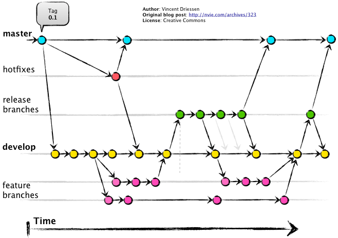

# Trabalho  de Gerenciamento de Configuração de Software

## GitFlow

### Convenções de branching

`main` and `develop` são branches protegidas e não permitem commits diretos. 

A forma correta de desenvolvimento nesse repositório é:

* Criar uma nova branch a partir da branch `develop`
* Realizar todo desenvolvimento e commits nessa branch nova
* Após conclusão, criar uma Pull Request, que será revisada e se passar pela revisão,
será então levada para branch `develop`
* Apenas após a conclusão do trabalho, então a branch `develop`
será mergeada com a branch `main`

### Importante

* Sempre de git pull na branch `develop` antes de criar uma branch nova apartir dela
* Qualquer dúvida, abordar o grupo no whatsapp, principalmente aqueles que nunca
criaram um Pull Request